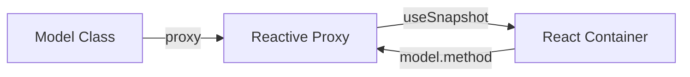

# State Management: Valtio

> Рекомендуемый подход для всех новых фич.

## Концепция

Model-класс хранит state (public поля) и логику (методы). Экземпляр оборачивается в `proxy()` для реактивности. React-компоненты подписываются через `useSnapshot()`.



---

## Структура Model

```typescript
import { Result, Ok, Err } from 'ts-results';
import type { Logger } from 'src/infrastructure/logging/Logger';

/**
 * @module MyFeatureModel
 * 
 * Модель для состояния фичи MyFeature.
 */
export class MyFeatureModel {
  // === State (public fields) ===
  
  data: MyData = initialData;
  state: 'initial' | 'loading' | 'loaded' = 'initial';
  error: string | null = null;

  constructor(
    private propertyModel: PropertyModel,
    private logger: Logger
  ) {}

  // === Commands (методы, меняющие state) ===

  async load(): Promise<Result<void, Error>> {
    const log = this.logger.getPrefixedLog('MyFeatureModel.load');
    
    this.state = 'loading';
    
    const result = await this.propertyModel.load();
    
    if (result.err) {
      this.error = result.val.message;
      this.state = 'initial';
      log(`Failed: ${result.val.message}`, 'error');
      return Err(result.val);
    }
    
    this.data = result.val;
    this.state = 'loaded';
    log('Loaded');
    return Ok(undefined);
  }

  setData(data: MyData): void {
    this.data = data;
  }

  reset(): void {
    this.data = initialData;
    this.state = 'initial';
    this.error = null;
  }

  // === Queries (getters, без side effects) ===

  get isEmpty(): boolean {
    return this.data.items.length === 0;
  }
}
```

### Что идёт в Model

- **State** — public поля класса (данные, статус, ошибки)
- **Commands** — методы, изменяющие state (load, save, set*, reset)
- **Queries** — getters, читающие state без side effects
- **DI** — зависимости через constructor

### Что идёт в Model методы

- Загрузка/сохранение данных (Jira API)
- Координация с другими models (через constructor DI)
- Вызов чистых функций для трансформации
- Обработка Result-ов
- Логирование через Logger

---

## Регистрация в DI

### tokens.ts — токены

```typescript
import { createModelToken } from 'src/infrastructure/di/Module';
import type { MyFeatureModel } from './models/MyFeatureModel';

export const myFeatureModelToken = createModelToken<MyFeatureModel>('my-feature/myFeatureModel');
```

`createModelToken<T>` создаёт `Token<ModelEntry<T>>`, где `ModelEntry<T> = { model: T; useModel: () => Readonly<T> }`.

### module.ts — класс Module

```typescript
import type { Container } from 'dioma';
import { Module, modelEntry } from 'src/infrastructure/di/Module';
import { myFeatureModelToken } from './tokens';
import { MyFeatureModel } from './models/MyFeatureModel';
import { loggerToken } from 'src/infrastructure/logging/Logger';

class MyFeatureModule extends Module {
  register(container: Container): void {
    this.lazy(container, myFeatureModelToken, c =>
      modelEntry(new MyFeatureModel(
        c.inject(loggerToken),
      )),
    );
  }
}

export const myFeatureModule = new MyFeatureModule();
```

### content.ts — централизованная регистрация

```typescript
import { myFeatureModule } from './my-feature/module';

function initDiContainer() {
  // ...shared services...
  myFeatureModule.ensure(container);
}
```

### Как это работает

1. `Module.ensure(container)` — идемпотентная регистрация (безопасно вызывать повторно)
2. `this.lazy()` — регистрирует factory-токен. Экземпляр создаётся **лениво** при первом `inject()`, затем кешируется
3. `modelEntry(instance)` — оборачивает экземпляр в `proxy()` и создаёт `{ model, useModel: () => useSnapshot(model) }`
4. `createModelToken<T>()` — создаёт типизированный токен `Token<ModelEntry<T>>`
5. Все модули регистрируются централизованно в `content.ts`, а не в отдельных PageModification

---

## Использование в React

`ModelEntry` из `modelEntry()` содержит два поля:

- **`model`** — живой **Valtio proxy** (тот же инстанс класса): через него вызывай **методы-команды** (`open`, `save`, `setEnabled`, `reset`, …), которые меняют `this.*`.
- **`useModel()`** — **`useSnapshot(proxy)`**: только для **чтения полей в рендере**; возвращаемый объект **глубоко read-only**. Если вызвать на нём метод, который пишет в state, в рантайме будет ошибка вида *Cannot assign to read only property* (у методов `this` указывает на снапшот, а не на proxy).

**Правило:** подписка на данные → `useModel()`; любые **вызовы методов модели** → **`model`**, а не результат `useModel()`.

```typescript
import { useDi } from 'src/infrastructure/di/diContext';
import { myFeatureModelToken } from '../tokens';

export const MyFeatureContainer: React.FC = () => {
  const { model, useModel } = useDi().inject(myFeatureModelToken);
  const state = useModel();

  const handleClick = () => {
    void model.load();
  };

  return (
    <MyFeatureComponent
      data={state.data}
      isLoading={state.state === 'loading'}
      onClick={handleClick}
    />
  );
};
```

Container: из DI берётся `ModelEntry` → в JSX читается **`state` из `useModel()`** (реактивность), в обработчиках и эффектах вызывается **`model.*`** (корректные мутации).

---

## Координация между моделями

Модели используют друг друга через constructor DI:

```typescript
export class SettingsUIModel {
  items: Item[] = [];
  editingId: number | null = null;

  constructor(
    private propertyModel: PropertyModel,
    private logger: Logger
  ) {}

  async save(): Promise<Result<void, Error>> {
    this.propertyModel.setItems(this.items);
    return this.propertyModel.persist();
  }

  initFromProperty(): void {
    this.items = [...this.propertyModel.data.items];
  }
}
```

```
PropertyModel ←─constructor─→ SettingsUIModel ←─constructor─→ RuntimeModel
```

---

## Тестирование

```typescript
import { proxy } from 'valtio';

describe('MyFeatureModel', () => {
  let model: MyFeatureModel;
  let mockPropertyModel: any;
  let mockLogger: any;

  beforeEach(() => {
    mockPropertyModel = { load: vi.fn(), save: vi.fn() };
    mockLogger = { getPrefixedLog: () => vi.fn() };
    model = proxy(new MyFeatureModel(mockPropertyModel, mockLogger));
  });

  it('should update state on load', async () => {
    mockPropertyModel.load.mockResolvedValue(Ok({ items: [1, 2, 3] }));
    
    await model.load();
    
    expect(model.state).toBe('loaded');
    expect(model.data.items).toEqual([1, 2, 3]);
  });

  it('should handle error', async () => {
    mockPropertyModel.load.mockResolvedValue(Err(new Error('Failed')));
    
    await model.load();
    
    expect(model.state).toBe('initial');
    expect(model.error).toBe('Failed');
  });

  it('should reset to initial state', () => {
    model.data = { items: [1] };
    model.state = 'loaded';
    
    model.reset();
    
    expect(model.data).toEqual(initialData);
    expect(model.state).toBe('initial');
  });
});
```

### Правила тестирования

- Новый `proxy(new Model(mockDeps))` в каждом `beforeEach`
- Моки зависимостей через constructor
- Тестируй methods и state, не реализацию
- `reset()` — обязательный метод в каждом model

---

## Структура файлов

```
src/features/my-feature/
├── types.ts                    # Доменные типы с JSDoc
├── tokens.ts                   # DI Tokens
├── module.ts                   # Регистрация Models в DI
│
├── property/
│   └── PropertyModel.ts        # Синхронизация с Jira
│
├── SettingsPage/
│   ├── models/
│   │   ├── SettingsUIModel.ts
│   │   └── SettingsUIModel.test.ts
│   └── components/
│       ├── SettingsContainer.tsx
│       └── SettingsModal.tsx
│
├── BoardPage/
│   ├── models/
│   │   ├── RuntimeModel.ts
│   │   └── RuntimeModel.test.ts
│   └── components/
│       └── BoardContainer.tsx
│
└── utils/
    ├── transformData.ts
    └── transformData.test.ts
```

---

## Правила

1. **State** — public поля класса
2. **Commands** — методы класса (async для API)
3. **Queries** — getters (`get isEmpty()`) — без side effects
4. **DI** — через constructor, не через `this.di`
5. **Module** — фича собирается в класс `extends Module`, регистрируется в `content.ts`
6. **`modelEntry()`** — оборачивает экземпляр в `proxy()` и создаёт `{ model, useModel }`
7. **`lazy()`** — ленивая регистрация: экземпляр создаётся при первом `inject()`
8. **`reset()`** — обязательный метод для сброса в тестах
9. **Result** — async методы возвращают `Result<T, Error>`
10. **Logger** — `this.logger.getPrefixedLog('ClassName.method')`
11. **Команды только через `model`** — методы модели (всё, что мутирует state) вызывай у **`entry.model`**, а не у значения **`entry.useModel()`**; последнее — только чтение полей для UI

---

## Антипаттерны

- ❌ Бизнес-логика в React-компонентах
- ❌ `useState` для данных модели
- ❌ `this.di.inject()` вместо constructor DI
- ❌ Вызывать методы модели (`save`, `open`, `setEnabled`, …) на объекте из **`useModel()`** — только на **`model`** из того же `ModelEntry`
- ❌ Прямой `useSnapshot(model)` — используй `modelEntry()` в `module.ts`
- ❌ `registerXxxModule()` функция — используй `class extends Module`
- ❌ Вызов `module.ensure()` в PageModification — регистрируй в `content.ts`
- ❌ State без `reset()`
- ❌ Getters с side effects
