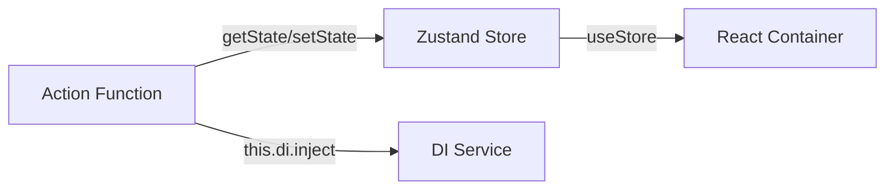

# State Management: Zustand + Actions

> ⏸️ **На холде.** Существующий код поддерживается, но новые stores создаются как Valtio Models.
> См. `docs/state-valtio.md` для рекомендуемого подхода.

## Концепция

Zustand Store — функция `create()` с state и actions. Actions координируют логику между stores. Immer (`produce()`) используется для иммутабельных обновлений.



---

## Структура Store

```typescript
import { create } from 'zustand';
import { produce } from 'immer';

type State = {
  data: MyData;
  state: 'initial' | 'loading' | 'loaded';
  actions: {
    setData: (data: MyData) => void;
    setState: (state: State['state']) => void;
    updateField: (field: string, value: unknown) => void;
    reset: () => void;
  };
};

export const useMyStore = create<State>()(set => ({
  data: initialData,
  state: 'initial',
  actions: {
    setData: data => set({ data }),
    setState: state => set({ state }),
    updateField: (field, value) => set(
      produce(state => { state.data[field] = value; })
    ),
    reset: () => set({ data: initialData, state: 'initial' }),
  },
}));
```

### getInitialState (обязательно для тестов)

```typescript
useMyStore.getInitialState = () => ({
  data: initialData,
  state: 'initial',
  actions: useMyStore.getState().actions,
});
```

---

## Actions (createAction)

Actions — функции, координирующие логику между stores и внешними сервисами. Не регистрируются в DI, но используют DI для получения зависимостей.

```typescript
import { createAction } from 'src/shared/action';

export const loadMyFeature = createAction({
  name: 'loadMyFeature',
  async handler() {
    const log = this.di.inject(loggerToken).getPrefixedLog('loadMyFeature');
    const store = useMyStore.getState();
    
    store.actions.setState('loading');
    
    const service = this.di.inject(BoardPropertyServiceToken);
    const data = await service.getBoardProperty('my-feature');
    
    if (data.err) {
      log(`Failed: ${data.val.message}`, 'error');
      store.actions.setState('initial');
      return;
    }
    
    const transformed = transformData(data.val);
    store.actions.setData(transformed);
    store.actions.setState('loaded');
    log('Loaded');
  },
});
```

### Связь между stores

```typescript
// actions/initFromProperty.ts
export const initFromProperty = () => {
  const propertyData = usePropertyStore.getState().data;
  useSettingsUIStore.getState().actions.setData(propertyData.limits);
};

// actions/saveToProperty.ts
export const saveToProperty = async () => {
  const uiLimits = useSettingsUIStore.getState().data.limits;
  usePropertyStore.getState().actions.setLimits(uiLimits);
  await saveProperty();
};
```

---

## Использование в React

```typescript
export const MyContainer: React.FC = () => {
  const data = useMyStore(s => s.data);
  const { setData, reset } = useMyStore(s => s.actions);
  
  return (
    <MyComponent 
      data={data}
      onChange={setData}
      onReset={reset}
    />
  );
};
```

Container подписывается на store через `useStore(selector)`.

---

## Тестирование

### Store тесты

```typescript
describe('MyStore', () => {
  beforeEach(() => {
    useMyStore.setState(useMyStore.getInitialState());
  });

  it('should set data', () => {
    useMyStore.getState().actions.setData({ name: 'test' });
    expect(useMyStore.getState().data.name).toBe('test');
  });

  it('should reset to initial state', () => {
    useMyStore.getState().actions.setData({ name: 'test' });
    useMyStore.getState().actions.reset();
    expect(useMyStore.getState().data).toEqual(initialData);
  });
});
```

### Action тесты

```typescript
describe('loadMyFeature', () => {
  beforeEach(() => {
    useMyStore.setState(useMyStore.getInitialState());
    vi.clearAllMocks();
  });

  it('should load data and update store', async () => {
    mockService.getBoardProperty.mockResolvedValue(Ok(mockData));
    
    await loadMyFeature();
    
    expect(useMyStore.getState().state).toBe('loaded');
    expect(useMyStore.getState().data).toEqual(expectedData);
  });
});
```

### Правила тестирования

- `useMyStore.setState(useMyStore.getInitialState())` в каждом `beforeEach`
- `getInitialState()` обязателен для каждого store
- Тестируй actions через store state, не через моки

---

## Структура файлов

```
src/features/my-feature/
├── types.ts                    # Доменные типы с JSDoc
│
├── property/
│   ├── store.ts                # Property Store: create<State>()
│   ├── interface.ts            # Типы store с JSDoc
│   └── actions/
│       ├── loadProperty.ts
│       └── saveProperty.ts
│
├── SettingsPage/
│   ├── stores/
│   │   ├── settingsUIStore.ts
│   │   └── settingsUIStore.test.ts
│   ├── actions/
│   │   ├── initFromProperty.ts
│   │   └── saveToProperty.ts
│   └── components/
│       └── SettingsContainer.tsx
│
├── BoardPage/
│   ├── stores/
│   │   └── runtimeStore.ts
│   └── components/
│       └── BoardContainer.tsx
│
└── utils/
    ├── transformData.ts
    └── transformData.test.ts
```

---

## Правила

1. **Store** — `create<State>()(set => ({...}))`
2. **Actions** — объект внутри store или отдельные `createAction`
3. **Мутации** — через `set()` + `produce()` (Immer)
4. **getInitialState()** — обязателен для тестов
5. **DI в actions** — `this.di.inject(token)` внутри `createAction`
6. **Result** — async actions проверяют `result.err`
7. **Logger** — `this.di.inject(loggerToken).getPrefixedLog('actionName')`

---

## Антипаттерны

- ❌ Создание **нового** Zustand store для **новой фичи** (используй Valtio)
- ❌ Store без `getInitialState()`
- ❌ Store без `reset()` action
- ❌ Бизнес-логика в React-компонентах
- ❌ `throw/catch` вместо Result
- ✅ Расширение существующего Zustand store — OK
