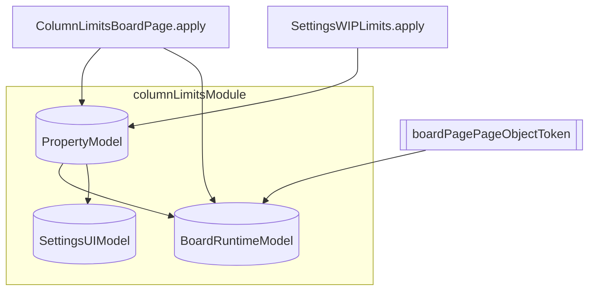

# Module Analysis

Analyzed: `src/column-limits-module/`

## Summary

| Area        | Models / entry        | DI registration              |
| ----------- | --------------------- | ---------------------------- |
| property    | `PropertyModel`       | `propertyModelToken`         |
| BoardPage   | `BoardRuntimeModel`   | `boardRuntimeModelToken`     |
| SettingsPage| `SettingsUIModel`     | `settingsUIModelToken`       |

`columnLimitsModule` (`module.ts`) registers all three models via `Module` base class. `BoardPagePageObject` is injected into `BoardRuntimeModel` for DOM work.

## Dependencies (high level)

- **Board page** (`BoardPage/index.ts`): `propertyModelToken`, `boardRuntimeModelToken` — `PropertyModel.setData`, `BoardRuntimeModel.setCssNotIssueSubTask` / `apply`, subscription on `#ghx-pool`.
- **Settings page** (`SettingsPage/index.ts`): `propertyModelToken` — `PropertyModel.setData`; settings UI uses `SettingsUIModel` via `settingsUIModelToken` inside containers (`useModel()` for read, `model` for commands — `docs/state-valtio.md`).
- **Registration**: `columnLimitsModule.ensure()` is called centrally in `content.ts`.

## Mermaid Diagram

**Legend:** rounded = valtio models; stadium = shared page object token.
