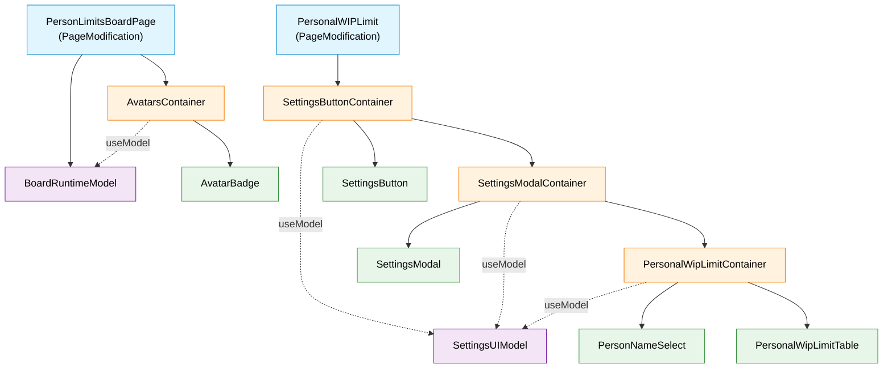

# Module Analysis

Analyzed: `src/person-limits-module/`

## Summary

| Area         | Model            | DI registration           |
| ------------ | ---------------- | ------------------------- |
| property     | `PropertyModel`  | `propertyModelToken`      |
| BoardPage    | `BoardRuntimeModel` | `boardRuntimeModelToken` |
| SettingsPage | `SettingsUIModel`   | `settingsUIModelToken`   |

`personLimitsModule` (`module.ts`) registers all three models via the shared `Module` base class (`lazy()` + `modelEntry()`). `BoardPagePageObject` is injected into `BoardRuntimeModel` for DOM work. `PropertyModel` is injected into both runtime and settings models.

**Tokens** (`tokens.ts`): `propertyModelToken`, `boardRuntimeModelToken`, `settingsUIModelToken` — created with `createModelToken()`.

**Registration**: `personLimitsModule.ensure(container)` in `content.ts`.

**Property layer** (`property/`): `types.ts`, `migrateProperty.ts`, `PropertyModel.ts` — no zustand store; load/persist/setData live on `PropertyModel` with `Result` for I/O.

## Dependencies (high level)

- **Board page** (`BoardPage/index.ts`): loads board property into `PropertyModel`, mounts `AvatarsContainer` with `BoardRuntimeModel` for stats, highlight, and avatar click filtering.
- **Settings page** (`SettingsPage/index.tsx`): settings UI containers use `SettingsUIModel` from `ModelEntry` — **`useModel()`** for reactive **read** of form state, **`model`** for **`initFromProperty` / `save`** and other commands (delegates persist to `PropertyModel`; see `docs/state-valtio.md`).
- **Pure helpers** remain direct imports: `createPersonLimit`, `updatePersonLimit`, `transformFormData` in `SettingsPage/utils/`, and board helpers in `BoardPage/utils/` (`isPersonLimitAppliedToIssue`, `isPersonsIssue`, `computeLimitId`).

## Architecture diagram (target state)

```mermaid
flowchart TB
    subgraph pageObjects ["page-objects/"]
        BoardPagePO["BoardPagePageObject<br/><small>DOM: issues, columns, swimlanes, visibility</small>"]
        style BoardPagePO fill:#FFA500,color:black
    end

    subgraph personLimits ["person-limits-module/"]
        Types["property/types.ts"]

        subgraph plTokens ["DI"]
            Tokens["tokens.ts"]
            PLModule["module.ts"]
        end

        subgraph property ["property/"]
            PropModel["PropertyModel"]
            style PropModel fill:#9370DB,color:white
        end

        subgraph boardPage ["BoardPage/"]
            BoardEntry["index.ts<br/>(PageModification)"]
            style BoardEntry fill:#FFA500,color:black
            RuntimeModel["BoardRuntimeModel"]
            style RuntimeModel fill:#9370DB,color:white
            AvatarsC["AvatarsContainer"]
            style AvatarsC fill:#4169E1,color:white
            AvatarBadge["AvatarBadge"]
            style AvatarBadge fill:#20B2AA,color:white
        end

        subgraph settingsPage ["SettingsPage/"]
            SettingsEntry["index.tsx<br/>(PageModification)"]
            style SettingsEntry fill:#FFA500,color:black
            UIModel["SettingsUIModel"]
            style UIModel fill:#9370DB,color:white
            BtnContainer["SettingsButtonContainer"]
            style BtnContainer fill:#4169E1,color:white
            ModalContainer["SettingsModalContainer"]
            style ModalContainer fill:#4169E1,color:white
            FormContainer["PersonalWipLimitContainer"]
            style FormContainer fill:#4169E1,color:white
        end

        subgraph utils ["SettingsPage/utils/"]
            CreateLimit["createPersonLimit"]
            UpdateLimit["updatePersonLimit"]
            TransformForm["transformFormData"]
        end

        subgraph boardUtils ["BoardPage/utils/"]
            IsApplied["isPersonLimitAppliedToIssue"]
            IsPersons["isPersonsIssue"]
            ComputeId["computeLimitId"]
        end
    end

    PLModule -->|lazy + modelEntry| PropModel
    PLModule -->|lazy + modelEntry| RuntimeModel
    PLModule -->|lazy + modelEntry| UIModel

    RuntimeModel -->|constructor DI| PropModel
    RuntimeModel -->|constructor DI| BoardPagePO
    UIModel -->|constructor DI| PropModel

    BoardEntry -->|inject| RuntimeModel
    BoardEntry -->|inject| PropModel
    AvatarsC -->|useModel| RuntimeModel

    BtnContainer -->|useModel| UIModel
    ModalContainer -->|useModel| UIModel
    FormContainer -->|useModel| UIModel

    RuntimeModel -->|direct import| IsApplied
    RuntimeModel -->|direct import| IsPersons
    RuntimeModel -->|direct import| ComputeId
```

## Component hierarchy

**Legend:** light blue — `PageModification` (non-React entry); orange — container; green — view; purple — valtio model.
