# Module Analysis

Analyzed: `src/wiplimit-on-cells/`

## Summary

| Module | Stores | Actions | DI Tokens | Containers |
|--------|--------|---------|-----------|------------|
| BoardPage | 1 | 1 | 1 | 0 |
| SettingsPage | 1 | 0 | 0 | 2 |
| property | 1 | 2 | 0 | 0 |

## Dependencies

**renderWipLimitCells** (action) uses:
  - `wipLimitCellsBoardPageObjectToken` (token)
  - `useWipLimitCellsRuntimeStore` (store)

**SettingsButtonContainer** (container) uses:
  - `SettingsModalContainer` (container)
  - `useWipLimitCellsSettingsUIStore` (store)

**SettingsModalContainer** (container) uses:
  - `useWipLimitCellsSettingsUIStore` (store)

**loadWipLimitCellsProperty** (action) uses:
  - `useWipLimitCellsPropertyStore` (store)

**saveWipLimitCellsProperty** (action) uses:
  - `useWipLimitCellsPropertyStore` (store)

## Mermaid Diagram

```mermaid
flowchart TB
    classDef store fill:#4CAF50,stroke:#2E7D32,color:#fff
    classDef action fill:#2196F3,stroke:#1565C0,color:#fff
    classDef token fill:#FF9800,stroke:#EF6C00,color:#fff
    classDef container fill:#9C27B0,stroke:#6A1B9A,color:#fff

    subgraph BoardPage["BoardPage"]
        useWipLimitCellsRuntimeStore[("useWipLimitCellsRuntimeStore")]
        renderWipLimitCells["renderWipLimitCells()"]
        wipLimitCellsBoardPageObjectToken{{"wipLimitCellsBoardPageObjectToken"}}
    end
    subgraph SettingsPage["SettingsPage"]
        useWipLimitCellsSettingsUIStore[("useWipLimitCellsSettingsUIStore")]
        SettingsButtonContainer["SettingsButtonContainer"]
        SettingsModalContainer["SettingsModalContainer"]
    end
    subgraph property["property"]
        useWipLimitCellsPropertyStore[("useWipLimitCellsPropertyStore")]
        loadWipLimitCellsProperty["loadWipLimitCellsProperty()"]
        saveWipLimitCellsProperty["saveWipLimitCellsProperty()"]
    end

    renderWipLimitCells --> wipLimitCellsBoardPageObjectToken
    renderWipLimitCells --> useWipLimitCellsRuntimeStore
    SettingsButtonContainer --> SettingsModalContainer
    SettingsButtonContainer --> useWipLimitCellsSettingsUIStore
    SettingsModalContainer --> useWipLimitCellsSettingsUIStore
    loadWipLimitCellsProperty --> useWipLimitCellsPropertyStore
    saveWipLimitCellsProperty --> useWipLimitCellsPropertyStore

    class useWipLimitCellsRuntimeStore,useWipLimitCellsSettingsUIStore,useWipLimitCellsPropertyStore store
    class renderWipLimitCells,loadWipLimitCellsProperty,saveWipLimitCellsProperty action
    class wipLimitCellsBoardPageObjectToken token
    class SettingsButtonContainer,SettingsModalContainer container
```

**Legend:**
- 🟢 Store (green)
- 🔵 Action (blue)
- 🟠 DI Token (orange)
- 🟣 Container (purple)